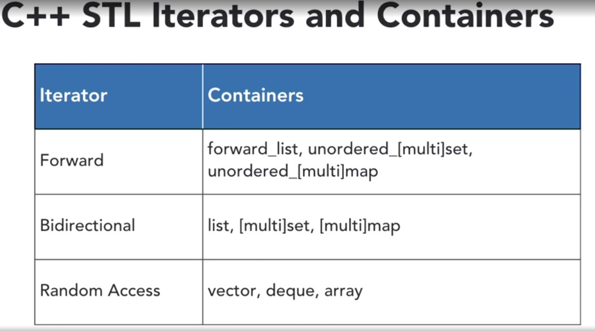

# Cplusplus-concepts

## Key features
| **topic** | **description** |
|-------|:--------------------
| References | They don't have pointers |
| Qualifier is const | const int * p, int const *p, int * const p
||
| Diff b/w struct and class| default scope in struct is public and default is private in class
||
| Range based for loop |
| Friend function and class |
| Constructor in private scope|
| virtual function and pure virtual function|
| exception - try, catch, throw, std::exception |
| functor = function object |
| predicate| A predicate is a C++ function returning a boolean or an object having a bool operator() member. A unary predicate takes one argument, a binary takes two, and so on|

### Standard Template Library

|**Associative containers**||
|------|:-----------------
|set   | the value itself acts as a key  + ordered + key is unique + elements cannot be modified
|multiset| ordered + multiple elements of same value allowed
|map| key value pair + ordered + key is unique
|multimap| key value pair + ordered + key can hold multiple values
|Unordered_set|
|Unordered_multiset|
|unordered_map|
|Unordered_multimap|

| **Sequence containers**||
|---------|:---------------
|array | non-reaizable array
|vector| Dynamic array + faster random access
|list| double linked list
|dequeue, queue, stack| Double ended queue + faster random access
|forward_list| singly linked list|
|priority queues| keeps its elements ordered naturally
|pair and tuple| part of utility

### **Iterators**
 

 
 ### **Big(O) for various containers **

 

 | **Container**|**Insertion**|**Access**|**Erase**|**Find**|**Persistant Iterators**
 |----------------------|:----------------------|:----------------------|:----------------------|:----------------------|:----------------------
 |Vector/String| Back: O(1) or O(n)   Other: O(n)|O(1)|Back: O(1)   Other:O(n)| Sorted: O(log n)   Other: O(n) | No
 |deque| Back/Front: O(1)   Other: O(n)|O(1)|Back/Front: O(1)   Other: O(n)|Sorted: O(log n)   Other: O(n) | Pointers only
 | list/ forward_list| Back/Front: O(1)   With iterator: O(1)   Index: O(n)|Back/Front: O(1)   With iterator: O(1)   Index: O(n)| Back/Front: O(1)   With iterator: O(1)   Index: O(n)| O(n) | Yes
 |set / map| O(log n)|-| O(log n)|O(log n)|Yes
 |unordered_set / unordered_map|O(1) or O(n)|O(1) or O(n)|O(1) or O(n)|O(1) or O(n)| Pointers only
 |priority_queue|O(log n)|O(1)|O(log n)|-|-

 ### Keywords
 |**keywords**|**description**|**example**|**extra reserach**|
 |----------------------|:----------------------|:----------------------|:-----------
 |decltype|
 |override|
 |static_cast|
 |Universal references|
 |Class declaration using keyword class and struct| Struch -> members defualt to public, class -> members default to private
 |const qualifier in fucntion declaration | function is const safe i.e cannot modify values. Any method that is called on a const-qualified object must be const safe. Rule of thumb is const methods can always be called from mutable and const objects. Non const methods can only be called by non const objects|int getv() const|const qualified function and object|
 |Implicit constructor, implicit copy constructor, implicit copy ('=') operator overloading| CL o1 = o2 : implcit copy operator, just o2 = o1 : implicit copy operator. Rule of three is: c++ provides implicit methods for copy constructor, destructor and the copy operator. The rule says, if you find yourself needing to provide any one of these 3 methods, you should probably provide all of them.
 | explicit | when a constructor has only one parameter, it can be used to provide implicit type conversion.This can be avoided by using the keyword explicit in constructor declaration.

